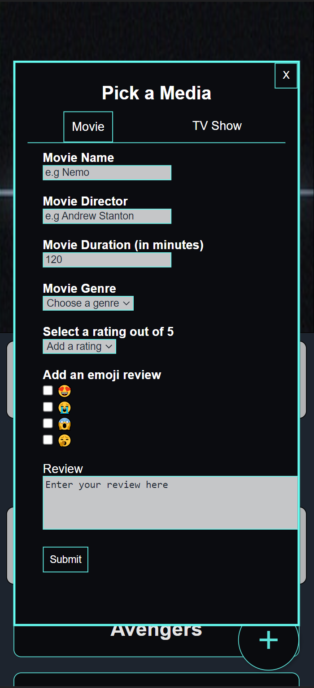
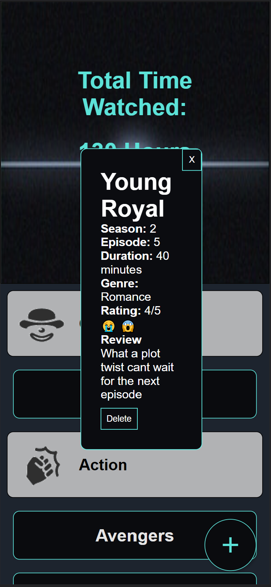

# Developers Documentation
## Overview 
The tracker is designed for people to track what movies and tv shows they have watched. The site allows for them to see what films they have watched, their reviews of the film and also see how many hours and minutes of film they have watched. The film name is displayed on the page underneath their allocated genre and when the user clicks on the name it pops up to show more detail of the film and their reviews for it.

## Changes from mid-fidelity 

### Main page
The main page has remained the same throughout most of the iteration process. There have been a few small changes made to make the site look more cohesive and visually appealing. 

The main heading at the top of the pages was changed to look more appealing and cohesive with the size changed to add hierarchy to draw the user into the time count. Similarly the text was changed from “Total hours watch x hours” to “Total time watched x Hours and x minutes,” to remove confusing decimals appearing when the time wasn't exactly an hour to make the feature useful and interpretable.  In Addition the colour was changed to make the title look more cohesive and consistent. The genre heading text colour has also changed from grey to black to make the text stand out more. 

#### Mid fidelity image 

#### Final image 

### Media buttons 
The media buttons design has changed significantly from the original design. The title is now only displayed on the button to reduce crowding and simplify the page. Moreover the delete button has been moved to inside the popup to stop users from accidentally deleting the buttons. 

#### Mid fidelity image 

#### Final image 

### Media popup 
The overall design of the dialog is the same however text heading and styling such as bolding, have been added to make the information simple and easy to read and interpret. In addition with the delete button now present in the dialog. I was careful with the placing of the button to reduce confusion with the user between the two buttons. I chose to place the close button in the top right corner to be consistent with my form popup but it is also a common layout for most web pages, with a similar design(the “X”) with what users are used to. The delete button was then placed at the bottom of the form to inorder to separate the two buttons as well as make it look consistent with the design with the button clearly being labelled “delete” to further prevent confusion for the user. Conversely the “X” button to close the popup was changed to be white to make it more consistent with the designs of all the buttons. 

#### Mid fidelity image 

#### Final image 

### Adding media popup 
The design of the adding media popup was simplified inorder to make the process simpler. The design originally was a “page” that diverts the user to a dead end form based on what media they want to add. This means that if the user was to press a movie and realise they made a mistake they would have to close the popup and open it up again to select TV. This has been changed to a “tab” style navigation that allows the users to flick between the forms based on which one they want to fill, making a more intuitive experience for the user. 

#### Mid fidelity image 

#### Final image 

### Forms 
The forms and intake of data has been altered to allow for a more intuitive website. When adding a move the user is prompted to add a director. This allows for the website to check to see if a movie has been added twice without removing another film with the same name. The TV form was updated so the season and episode data was collected on seperate lines. Additionally the emoji review had been charged from a dropdown input to a checkbox input to allow for the users to add more than one emoji that describes the film. finally I made the popup box big enought so the form was one page without the user needing to scroll. 

#### Mid fidelity image 

#### Final image 

### Mobile Version 
all the error fiex and altered on the desktop version where the same for the mobile version

#### Final images

## Configuration and setup for developers 
The git repository was created using parcel and SCSS so the best way to configure the site is to download or clone the repository to an IDE such as vscode and host the site on chrome with the command “nvm run dev”

### The best way to view the desktop view:
1. Download or clone the repository to an IDE such as vscode 
2. Host the site via the command “nvm run dev” in the terminal
3. Open the host site in chrome
4. View the site on a screen size of 1500x869px

### The best way to view the mobile view of the website:
1. Download or clone the repository to an IDE such as vscode 
2. Host the site via the command “nvm run dev” in the terminal
3. Open the host site in chrome
4. Open developer tool

5. Expand the developer tool screen until the chrome view of the website is 414x896 px

6. Then press the toggle device toolbar in the top left of the screen and change the dimations to "Iphone XR"

## Further improvements and extensions
There are a few further improvements and extensions that can be added to the website such as:
- Allowing the media to be stored in alphabetical order within their genre field
- User being allowed to upload an image of the film
- Being able to add or change the given genres 
- Being able to edit your response. 

## Bibliography 
- 50 Gorgeous Color Schemes From Stunning Websites. (2016). Retrieved 28 April 2023, from https://visme.co/blog/website-color-schemes/
- Tv Switch Off with Analog Static Noise texture. (2023). Retrieved 28 April 2023, from https://elements.envato.com/-tv-switch-off-with-analog-static-noise-texture-R3U3HMM 
- Windows 8 icons movie genres.(2018). Retrieved 2 June 2023, from https://icons8.com/download/icons/windows_8_icons_movie_genres.png